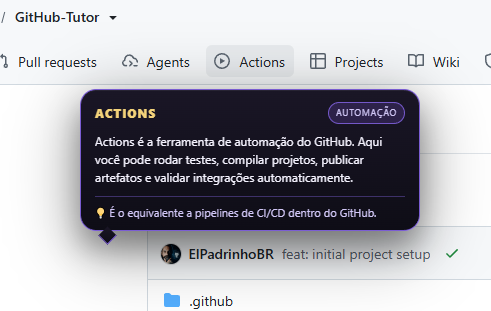
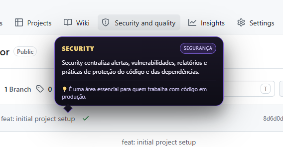
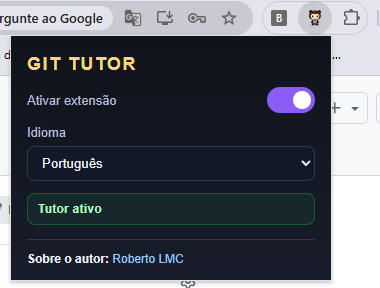

# 🎓 Git Tutor - Extensão Educativa do GitHub

[](https://opensource.org/licenses/MIT)


**Git Tutor** é uma extensão de navegador educativa que transforma o GitHub em uma plataforma de aprendizado interativo. Ao passar o mouse sobre elementos da interface, balões estilizados explicam conceitos, funções e boas práticas — tudo em português, espanhol ou inglês.

Perfeita para iniciantes que desejam entender a interface do GitHub sem abandonar a página, ou educadores que buscam ferramentas didáticas modernas.

---

## ✨ Principais Recursos

- 🌍 **Suporte multilíngue**: Português, Inglês e Espanhol
- 🎨 **Design moderno**: Tooltips estilizadas com animações suaves
- 🔒 **Shadow DOM**: Estilos isolados que não conflitam com GitHub
- ⚡ **Lightweight**: Sem dependências externas, apenas TypeScript
- 🛠️ **Fácil de personalizar**: Adicione novos elementos facilmente
- 📱 **Responsivo**: Funciona em qualquer tamanho de tela
- 🎯 **Cobertura completa**: Explica +30 elementos do GitHub

---

## �️ Screenshots

<div align="center">
  
  <br /><br />
  
  <br /><br />
  
</div>

---

## �📚 Elementos Cobertos

### Navegação & Abas
- **Code** - Visualização de arquivos e estrutura
- **Issues** - Rastreamento de bugs
- **Pull Requests** - Propostas de mudanças
- **Discussions** - Conversas abertas
- **Actions** - Automação e CI/CD
- **Projects** - Planejamento visual
- **Insights** - Métricas e análises
- **Settings** - Configurações do repositório
- **Security** - Alertas de segurança
- **Releases** - Versões publicadas
- **Wiki** - Documentação colaborativa
- **Deployments** - Histórico de publicações

### Interações & Botões
- **Fork** - Copiar repositório
- **Star** - Marcar como favorito
- **Watch** - Acompanhar atualizações
- **Branches** - Linhas de desenvolvimento
- **Tags** - Marcadores de versão
- **Commits** - Histórico de mudanças
- **License** - Informação legal

### Painéis & Contexto
- **About** - Resumo do projeto
- **Topics** - Categorias
- **README** - Documentação principal
- **Estrutura de Arquivos** - Árvore do projeto
- **Repositories** - Lista de projetos

---

## 🚀 Instalação Rápida

### Para Usuários (Chrome/Edge)

1. Clique no ícone Git Tutor → **Extensões**
2. Ative **"Modo de desenvolvedor"** (canto superior direito)
3. Clique **"Carregar extensão sem compactação"**
4. Selecione a pasta do projeto
5. ✅ Pronto!

### Para Desenvolvedores

```bash
# Clone o repositório
git clone https://github.com/ElPadrinho/git-tutor.git
cd git-tutor

# Instale as dependências
npm install

# Compile o projeto
npm run build

# Carregue em chrome://extensions (modo desenvolvedor)
```

---

## 🎮 Como Usar

1. **Navegue até o GitHub** e abra qualquer repositório
2. **Passe o mouse** sobre elementos com a extensão ativa
3. Um **balão de ajuda** aparecerá com explicação
4. Clique no **ícone Git Tutor** para:
   - Ativar/Desativar
   - Escolher idioma (PT/EN/ES)
   - Ver status atual

---

## 🛠️ Desenvolvimento

### Build do Projeto

```bash
# Build otimizado (bundled)
npm run build

# Watch mode (recompila ao salvar)
npm run watch
```

### Estrutura de Arquivos

```
git-tutor/
├── src/
│   ├── content.ts           # Script injetado no GitHub
│   ├── popup.ts             # Lógica do popup
│   ├── settings.ts          # Gerenciamento de config
│   ├── tooltip.ts           # Componente do balão
│   └── data/
│       └── tutor-content.ts # Conteúdo educativo
├── dist/                    # Arquivos compilados
├── manifest.json            # Manifesto Manifest V3
├── popup.html               # Interface do popup
├── ico.png                  # Ícone da extensão
├── build.js                 # Script de build
├── package.json             # Dependências
├── tsconfig.json            # Config TypeScript
└── README.md
```

### Adicionar Novo Elemento

1. **Editar [src/content.ts](src/content.ts)** - Adicionar detecção:
   ```typescript
   if (signal.includes('seu-elemento')) return 'seuElementoKey';
   ```

2. **Editar [src/data/tutor-content.ts](src/data/tutor-content.ts)** - Adicionar conteúdo:
   ```typescript
   seuElementoKey: {
     title: 'Título',
     category: 'Categoria',
     description: 'Explicação...',
     tip: 'Dica...'
   }
   ```

3. **Compilar**: `npm run build`

4. **Testar**: Recarregar em `chrome://extensions`

---

## 🌐 Idiomas Suportados

- 🇧🇷 **Português** (Padrão)
- 🇺🇸 **English**
- 🇪🇸 **Español**

---

## 🔐 Privacidade & Segurança

- ✅ Nenhum dado coletado ou enviado
- ✅ Configurações armazenadas localmente
- ✅ Funciona offline
- ✅ Sem rastreamento
- ✅ Código aberto

---

## 📝 Licença

MIT License - Veja [LICENSE](LICENSE) para detalhes.

---

## 🤝 Contribuindo

Sua contribuição é bem-vinda!

1. **Fork** o repositório
2. Crie uma **branch** (`git checkout -b feature/AmazingFeature`)
3. **Commit** suas mudanças (`git commit -m 'Add AmazingFeature'`)
4. **Push** (`git push origin feature/AmazingFeature`)
5. Abra um **Pull Request**

Veja [CONTRIBUTING.md](CONTRIBUTING.md) para diretrizes.

---

## � Roadmap

### ✅ Phase 1 (Atual - v0.1.0)
- [x] Extensão Manifest V3 base
- [x] Detecção de 30+ elementos GitHub
- [x] Sistema de tooltips com Shadow DOM
- [x] Suporte multilíngue (PT/EN/ES)
- [x] Menu de ativar/desativar
- [x] Seletor de idioma no popup
- [x] Documentação completa

### 📋 Phase 2 (Planejado)
- [ ] Tooltips contextuais por tipo de página (repository, issue, PR)
- [ ] Tutoriais em sequência interativa
- [ ] Atalhos de teclado personalizáveis
- [ ] Temas customizáveis (modo escuro/claro)
- [ ] Persistência de histórico de tooltips

### 🎯 Phase 3 (Futuro)
- [ ] Sistema de badges de progresso
- [ ] Integração com GitHub API para dados em tempo real
- [ ] Análise de uso com privacidade garantida
- [ ] Community marketplace de tutoriais
- [ ] Suporte a mais idiomas

---

## �📞 Contato

- 👤 **Autor**: Roberto LMC
- 🔗 **LinkedIn**: [linkedin.com/in/robertolmc](https://www.linkedin.com/in/robertolmc/)
- 🐛 **Issues**: [GitHub Issues](https://github.com/ElPadrinho/git-tutor/issues)

---

**Feito com ❤️ para a comunidade de desenvolvedores**
